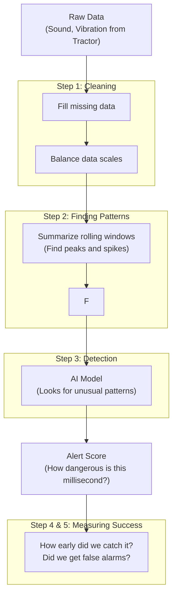

# ESoC 2026 — Project Proposal

## Embedded AI for Predictive Sensor Systems in Agriculture 4.0

**Applicant:** Sumit Goyal | **GitHub:** [itvi-1234](https://github.com/itvi-1234) | **Email:** Sumit.goyal.cse@gmail.com
**Institute:** IIIT Kota | B.Tech CSE (3rd Year) | **Timezone:** IST (UTC+5:30)

---

## 1. Basic Information

| Field | Detail |
|---|---|
| **Name** | Sumit Goyal |
| **GitHub** | [itvi-1234](https://github.com/itvi-1234) |
| **Email** | Sumit.goyal.cse@gmail.com |
| **Contact** | +91 9460357477 |
| **LinkedIn** | [Sumit Goyal](https://linkedin.com/in/itvi-1234) |
| **TimeZone** | IST (GMT+05:30) |

---

## 2. Academic Background

My name is Sumit Goyal, and I am a third-year B.Tech student in Computer Science and Engineering at IIIT Kota.

I am interested in software development and enjoy building real-world projects. I have experience working with C++, Python, Docker, Kubernetes and web technologies, and I am also exploring AI/ML and automation. 

I have worked on multiple projects where I built systems to automate tasks and process data efficiently and developed tools that helped reduce manual work and improve data handling. I have also gained practical exposure through several learning and competitive experiences. I completed an internship at MediaTechTemple, was selected for the Amazon ML Summer School’25, was a finalist at the Smart India Hackathon (SIH), and won the OpenAI × NextWave Buildathon (Rajasthan Regionals).

---

## 3. Development Experience & Projects

I have worked on several projects and internships focused on solving real-world problems through automation and intelligent systems.

**Backend & Automation Intern @ MediaTechTemple**
During my internship at MediaTechTemple, a media-focused organization, I worked on reducing manual effort involved in collecting news and government job updates. The team previously gathered this information manually from newspapers and recruitment portals. To automate this workflow, I built data extraction pipelines using Python, Selenium, and Chromium that automatically collected and structured information from multiple sources. This included a news aggregation system and a government jobs collector, which significantly reduced repetitive manual work while improving efficiency and reliability. This was also my first onsite development experience, where I worked closely with a team, received mentor feedback, debugged systems, and iteratively improved the solutions.

**Amazon ML Summer School '25**
I was also selected for the Amazon ML Summer School, ranking among the top 3,000 applicants out of 60,000+ candidates across India. During the program, I learned the fundamentals of machine learning, deep learning, and neural networks from Amazon researchers.

**AgriVision AI (Smart India Hackathon Finalist)**
I have worked on AI-based systems such as [AgriVision AI](https://frontend-taupe-rho-64.vercel.app/), developed during the Smart India Hackathon Finals, which helps farmers detect crop diseases and stress using CNN, LSTM, YOLO, and hyperspectral imaging techniques.

**WhatsApp Business AI Agent**
I also built a [WhatsApp Business AI Agent](https://github.com/itvi-1234/whatsapp-ai-agent) that automates customer interactions and handles large volumes of chats reliably through automation pipelines and robust error handling.

Through these experiences, I have gained practical experience with Python, C++, React, Flask, APIs, Selenium, and AI/ML tools, while actively contributing to open-source projects using Git.

*(For additional details, please see my Resume: [Link to Resume])*

---

## 4. Open Source Contributions

I actively contribute to open-source projects, focusing on building reliable tools and fixing core logical bugs.

### CNCF Kubernetes Headlamp
I have contributed to **Headlamp**, a CNCF project that provides an easy-to-use UI for Kubernetes. I helped improve how resources are displayed and handled inside the dashboard.
- **Link to my work:** [CNCF Headlamp PRs by itvi-1234](https://github.com/kubernetes-sigs/headlamp/pulls?q=is%3Apr+author%3Aitvi-1234+is%3Aclosed)

### sktime (Time Series Analysis)
To prepare for this project, I have already started fixing bugs inside `sktime`'s anomaly detection modules:
1. **[fix-sublof-pipeline-bugs]:** I fixed a major bug in the `SubLOF` model where it was ignoring all sensor data except the very first one. I also fixed a silent error in the `DetectorPipeline` that was hiding bad pipeline configurations.
2. **[refactor-stray-detector]:** I rewrote the `STRAY` detection algorithm so that it properly registers as a "Detector" instead of a "Transformer", making it ready for the benchmarking tools we will build in this project.

---

## 5. Project Overview

**The Goal:** Imagine a large tractor farming a field. If a large rock gets pulled into the machine, it can destroy the blades, costing thousands of dollars. The goal of this project is to use **Embedded AI** and **sktime** to look at real-time sensor data (like sound and vibration) and detect that rock *before* it breaks the machine.

**The Challenge:** The data comes in extremely fast (every millisecond) from different types of sensors. We need to build algorithms that learn what a "normal" farming day looks like, so that the moment something sounds or feels wrong, the system triggers an alert. We also need to measure *how early* we caught the problem, not just if we caught it.

---

## 6. How We Will Build It (Technical Approach)

We will build a clear, step-by-step pipeline using `sktime`:

1. **Cleaning the Data (Pre-processing):** Real-world sensors sometimes drop data. We will fill in the blanks using `Imputer` and scale the numbers so that loud noises and small vibrations can be compared fairly.
2. **Finding Patterns (Feature Extraction):** Raw sound waves are hard for AI to read. We will summarize the data every few milliseconds to find patterns—like how "spiky" the vibration is (Kurtosis) or the energy of the sound (FFT).
3. **Spotting Anomalies (Detection Models):** We will train AI models (like SubLOF or HMM) using only data from normal, safe days. When a stone enters, the data will look different, and the AI will flag it.
4. **Measuring Success (Evaluation):** We will build new tools to measure how many false alarms we get (FPR) and, most importantly, how many milliseconds of warning we gave the farmer before the crash (Advance Detection Time).
5. **Comparing Models (Benchmarking):** We will build a testing tool to run different AI models side-by-side to see which one performs the best on the sponsor's dataset.

---

## 7. Implementation Architecture

Here is a simple map of how data will flow through our system:



---

## 8. Code Examples & Explanations

Here is a look at how the code for this project will actually be written using `sktime`.

### Example 1: The Full Detection Pipeline
**What it does:** This code connects our data cleaning, pattern finding, and AI detection into one single chain.
**Why we need it:** Instead of running 5 different scripts manually, a pipeline allows the system to process incoming tractor data automatically in one smooth motion.

```python
from sktime.detection.compose import DetectorPipeline

# Chain the steps together
pipeline = DetectorPipeline(steps=[
    ("clean_data", RobustScaler()), 
    ("find_patterns", WindowSummarizer(lag_feature={"mean": [50]})), 
    ("ai_detector", SubLOF(n_neighbors=20, novelty=True)), 
])

# Teach it what "normal" looks like
pipeline.fit(normal_tractor_data)

# Test it on real field data to find the rocks
danger_scores = pipeline.predict_scores(live_field_data)
```

### Example 2: Advance Detection Time Metric
**What it does:** Calculates how many milliseconds passed between our AI ringing the alarm and the actual moment the rock hit the machine.
**Why we need it:** Standard AI metrics just say "Correct" or "Incorrect". For this project, a "Correct" guess is useless if it happens after the machine is already broken. We need to optimize for *earliness*.

```python
class AdvanceDetectionTime:
    # ... setup code ...
    def calculate_score(self, actual_event_time, predicted_event_time):
        # Find how much warning time we gave the driver
        warning_time = actual_event_time - predicted_event_time
        
        # If we warned them early enough, it's a good score!
        return warning_time
```

### Example 3: Finding the Best Settings Automatically (Auto-Tuning)
**What it does:** Tests hundreds of different AI settings automatically to find the ones that catch the most rocks with the fewest false alarms.
**Why we need it:** Humans shouldn't guess the math settings. This tool will ensure the manufacturer always deploys the safest, most accurate model to their tractors.

```python
from sktime.detection.compose import AutoTunedDetector

# Tell the tuner to test different sensitivity levels
tuner = AutoTunedDetector(
    estimator=SubLOF(),
    param_grid={"sensitivity": [0.01, 0.05, 0.1]},
)

# It will find the best setting automatically
tuner.fit(training_data)
print("The best setting is:", tuner.best_params_)
```

---

## 9. 3-Month Timeline

The project officially begins on **May 25** and runs for 3 months. 

| Phase | Dates | Goals |
|---|---|---|
| **Phase 1: Setup & Data Prep** | May 25 – June 10 | **Community Bonding:** Understand the sponsor's dataset perfectly. Set up the local environment and map out the exact data structures needed. |
| **Phase 2: Extracting Features** | June 11 – June 25 | Build the tools to summarize the sound and vibration data (RMS, Kurtosis, FFT bands). Ensure the models can read this data. |
| **Phase 3: Measuring Success** | June 26 – July 10 | Write the custom evaluation metrics: `DetectionTPR` (Did we catch it?), `DetectionFPR` (False alarms?), and `AdvanceDetectionTime` (How early?). |
| **Phase 4: Benchmarking (Midterm)** | July 11 – July 25 | Build the `DetectionBenchmark` tool to test different algorithms against each other. *Midterm evaluations occur during this phase.* |
| **Phase 5: Auto-Tuning** | July 26 – Aug 10 | Build the `AutoTunedDetector` so the system can automatically find the best settings without human guesswork. |
| **Phase 6: Explainability & Wrap-up** | Aug 11 – Aug 25 | **Stretch Goal:** Add SHAP integration to tell us *which* sensor (e.g., sound vs vibration) triggered the alarm. Finalize all documentation, tutorials, and pull requests. |

---

## 10. Availability

I have no other commitments this summer. I will be able to fully prioritize this project for the entire 3-month duration, dedicating **30–35 hours per week**. I am highly responsive and will maintain regular communication with my mentors via Slack and GitHub.

---

## 11. Why Me?

1. **I understand the domain:** Through my work on **AgriVision AI**, I already know how to handle live sensor streams for agriculture. Foreign object detection is the exact same logic, just applied to safety-critical hardware.
2. **I am already in the code:** I didn't just read the `sktime` documentation; I actively submitted code to fix their anomaly detection tools before writing this proposal.
3. **I build real things:** As shown by my internship at MediaTechTemple and my WhatsApp AI Agent, I don't just write scripts—I build automated systems that work reliably in the real world.
4. **I can explain my work:** I believe good code is useless if no one can understand it. I prioritize writing clear documentation and easy-to-read code.

---
*Submitted for ESoC 2026*
